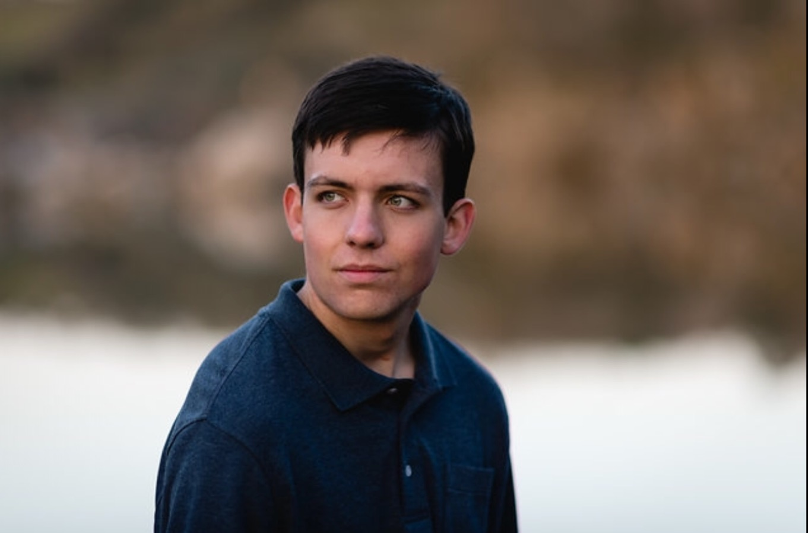

# Max Stickels' UX Portfolio

I'm Max Stickels, from Valley Springs, CA. I started my Computer Science degree with three long years at Caltech, and am now planning to finish my degree here at CSU Chico. I've loved programming for a long time, but also enjoy video games, making music, and going on long walks around Chico. I am currently working remotely for two Bay-Area based startups, so I am looking forward to learning how I can make higher-quality, more usable work.

## UX Team Project

[Tee-Together](https://chicostate.github.io/UX-Tee-Together/)

## UX Journal

[Read "The Day The Microwave Lost Its Voice"](j01/)
