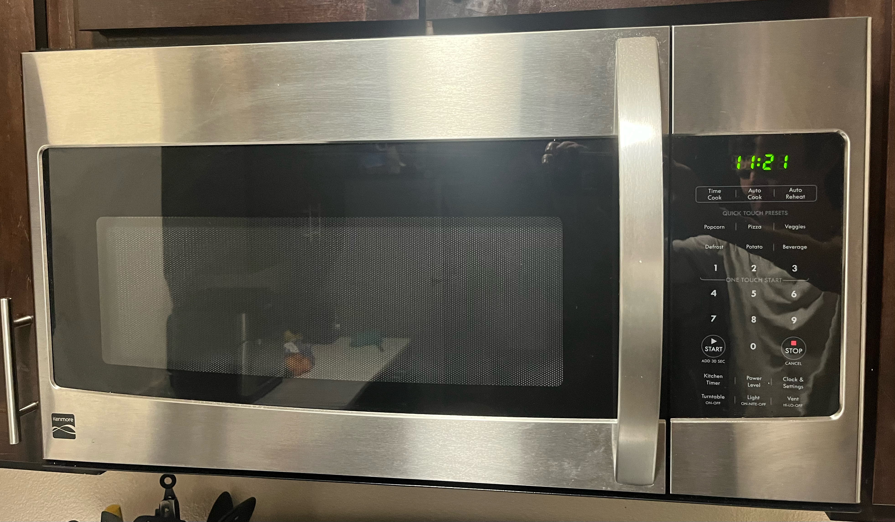
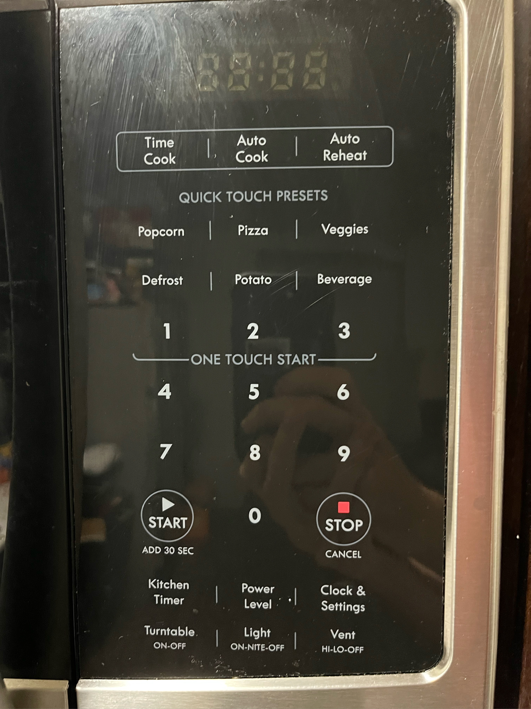
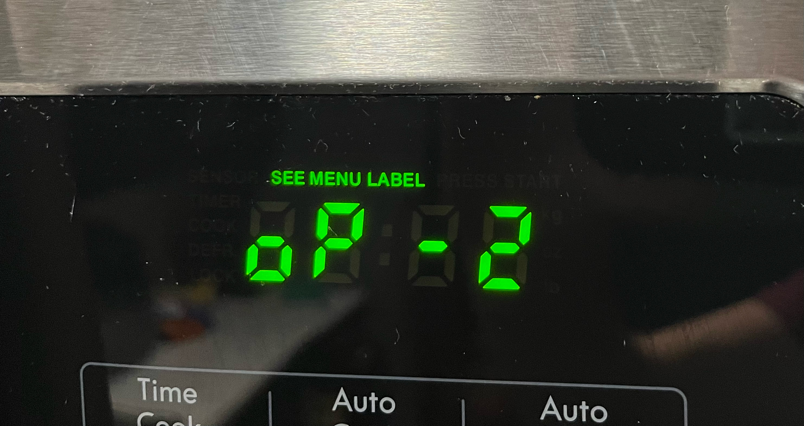

# UX Journal 01 - The Day The Microwave Lost Its Voice

*By Max Stickels - Created 10/9/2023 - Revised 12/9/2023*

Below is a photo of the Kenmore Model 790 microwave in my apartment suite - let's call it "Ken" for short.

Ken has been an invaluable tool for a college student like me, who can't be bothered to actually cook anything besides pasta and chicken breasts. It has all of the features I need (and several I don't) clearly spelled out for me, right at my fingertips. Its thorough adherence to existing microwave standards makes its interface so instantly recognizable that I could probably nuke a Jimmy Dean Croissant Egg Sausage and Cheese Breakfast Sandwich to perfection with my eyes closed. Over the years, I have grown all too familiar with the shrill 2000 Hz beeps of microwaves like Ken, giving me clear feedback that the buttons I'm pressing work, or that my food is ready to go. Perhaps out of hubris, I had come to believe that my **mental model** of how Ken worked was true to the **design model** - that my assumptions and expectations of Ken's functionality were one-to-one with those of Ken's creators - that I knew Ken better than Ken knew itself.

Then, on September 25th 2023, Ken went silent.

To be clear, Ken was not dead. Ken still hummed softly as it slowly spun my food, exciting the water molecules within. But the 2000 Hz beep I had come to know was no more. As the image below shows, there's a button to toggle the vent, fan, light, and power level. The beep, however, was a constant. I speculated that maybe something had shorted out during the recent power outage, or the hardware of the beeping component broke. In any case, I was forced to come to terms with the reality that Ken would never beep again.

At first the silence was deafening. With time, however, I began to recognize something had changed about myself. Before, whenever Ken's timer was close to running out, I would dash over and try to hit the STOP button at the perfect time before it could make a sound. Now, I felt no such pressure - instead, Ken would simply stop on its own terms, and I would feel a subtle sense of relief wash over me. While Ken's “Kitchen Timer” functionality was now considerably less useful, I generally didn't microwave things for longer than a couple of minutes anyways, so I had no problem remembering to get my food once the time came.

I eventually came to the groundbreaking realization that loud, high-pitched beeps are *annoying* and always have been. While Ken's vow of silence was wholly unanticipated, I felt that it was truly not something I could live without. And so, I looked forward to a new day, free of this minor annoyance which had unknowingly gotten under my skin for years on end.

That would have been where the story ended, if I had not procrastinated on this assignment. This all could have been a short and sweet journal entry discussing the tradeoffs of using a loud shrill beep as audio feedback, highlighting the cases where a silent microwave can make certain tasks more difficult. But a week later, as if nothing had ever changed, Ken was beeping once again.

Baffled, and now not so comfortable with the idea of going back to the 2000 Hz status quo, I began to brainstorm as to what could have happened, and - more crucially - how I could undo it. Something or someone had turned off the microwave's sound, and for my sanity I *needed* to be able to do it again. It was then that I recalled the one button on the microwave I truly did not understand - Clock and Settings. What if the beep was a setting you could toggle after all?

The Clock part I knew perfectly well. If you press the Clock and Settings button once, the current time flashes on screen; simply input the time you want on the number pad and press START. Press the Clock and Settings twice, however, and nothing makes sense anymore.

I know what seeing is, but seriously - what is a “menu label”? What on Earth is an “oP 2”? When previously confronted with this nonsense, I would simply hit STOP to exit, fearing I might seriously mess things up otherwise. Not this time.

I decided to hit Clock and Settings again, and the display changed to “oP 3”; again and it changed to “oP 4”. The pattern was obvious now - Ken was enumerating some unknowable list of options (or operations?). With “oP 4” on the display, and with great uncertainty in my heart, I pressed the START button, hoping and praying that Ken would not strike me down for my foolish acts of trial-and-error. What happened next was… nothing?

For a moment I thought I didn’t press the button properly. I looked up from the START button towards the display, which now read “oFF”, and suddenly all the pieces of this obscure puzzle came crashing together. I pressed STOP and repeated the process - sure enough, the beeping returned. Some way, somehow, I had found the setting which made Ken silent. "oP 4" is now in my control. Ken remains silent to this day, but now I hold the power to turn Ken's beeping on or off at any time for any reason. 

Why a feature as simple and useful as toggling the sound is not a pressable button on its own is beyond me. Even changing the name from “oP 4” to something human-readable like “BEEP” would have made more sense than what made it into the final product. What’s more, I do not know how the sound got switched off to begin with. I still do not know what a “menu label” is, or what the other “operations” do, or whether "oP" is supposed to stand for Option or Operation. All the extra buttons I have never bothered to use seemed so simple and predictable in the past, but now nothing is certain. I will likely go to my grave not knowing many of these things about Ken. *Yet I truly know now that I know nothing.*
